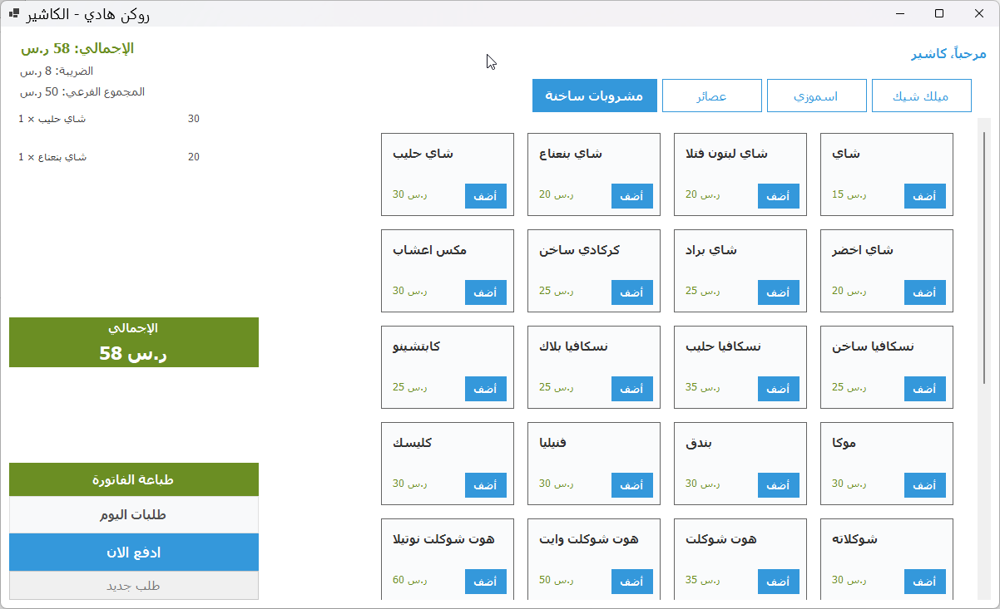
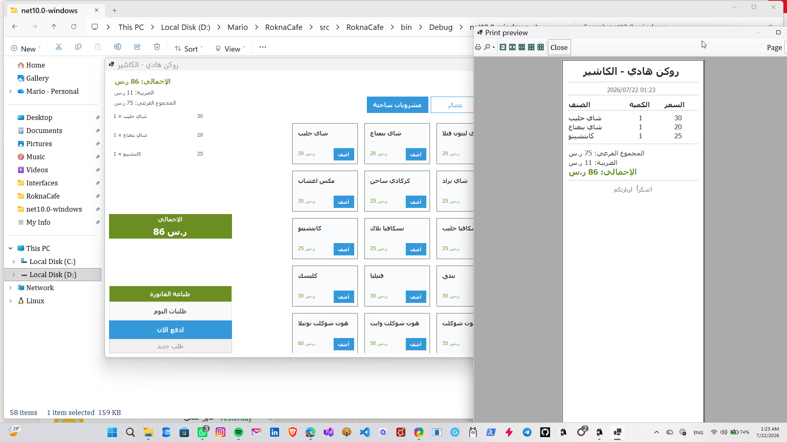

# RoknaCafe-POS

A complete Point-of-Sale desktop application for cafes and small retail businesses, built with .NET 10 and WinForms.


## Features

- Category-based menu management with Arabic RTL UI
- Real-time order building with quantity and totals
- 15% tax calculation
- 80mm thermal receipt printing (no logo dependency)
- Paid orders viewer with date filtering, daily totals, and item breakdown
- SQLite database with EF Core migrations and seeding
- Clean Architecture with separation of Domain, Infrastructure, and UI layers

## Screenshots




## Architecture

- `Rokna.Domain`: Entities, interfaces, and business rules
- `Rokna.Infrastructure`: Repositories, services, EF Core DbContext, and migrations
- `RoknaCafe`: WinForms UI layer with dependency injection

## Tech Stack

- .NET 10
- WinForms
- Entity Framework Core
- SQLite
- Clean Architecture
- Repository Pattern
- Dependency Injection

## Getting Started

```bash
git clone https://github.com/<YOUR_USERNAME>/RoknaCafe-POS.git
cd RoknaCafe-POS/src
dotnet build
dotnet run --project RoknaCafe/RoknaCafe.csproj
```

## License

MIT License. Feel free to use this project for learning and portfolio purposes.
